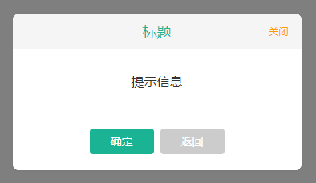
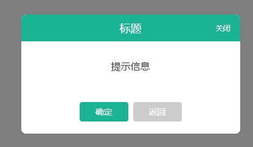
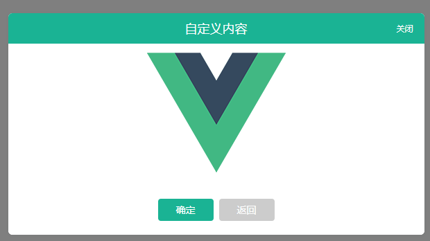

# 开发Vue组件系列之模态框

## 记录日期为2019-04-17

> 开发Vue组件系列之模态框,主要有标题、内容、定时器、按钮文案、按钮事件回调、遮罩层这些可配置项

项目基础工程文件是使用Vue-cli 3.0搭建的,这里不过多介绍

### 使用命令行
```bash
$ Vue create echi-modal
$ cd echi-modal
$ npm install
$ npm run serve
$ npm run build
$ npm run lint
```

### 添加vue.config.js文件,配置如下
```js
const path = require("path");

function resolve(dir) {
  return path.join(__dirname, dir);
}

module.exports = {
  // eslint-loader 是否在保存的时候检查
  lintOnSave: false,
  // webpack配置
  // see https://github.com/vuejs/vue-cli/blob/dev/docs/webpack.md
  chainWebpack: config => {
    config.resolve.alias
      .set("@", resolve("src"))
  },
  // 生产环境是否生成 sourceMap 文件
  productionSourceMap: false,
  // css相关配置
  css: {
    // 是否使用css分离插件 ExtractTextPlugin
    extract: true,
    // 开启 CSS source maps?
    sourceMap: false,
    // css预设器配置项
    loaderOptions: {},
    // 启用 CSS modules for all css / pre-processor files.
    modules: false
  },
  // use thread-loader for babel & TS in production build
  // enabled by default if the machine has more than 1 cores
  parallel: require("os").cpus().length > 1,
  devServer: {
    port: 9595,  // 端口号
    open: true, // 自动开启浏览器
    compress: true, // 开启压缩
    overlay: {
      warnings: true,
      errors: true
    }
  }
};

```

### 项目结构
```bash
├── src                            # 项目源码。开发的时候代码写在这里。
│   ├── components                 # 组件目录
│   ├── App.vue                    # 项目根视图
│   ├── main.js                    # 程序主入口
```

### 部分截图

<div align="center">
    
    
    
</div>

### modal组件模板

> 使用 `transition` 可以为组件添加动效;对应的组件模板内容如下

```html
<template>
  <transition name="toggle">
    <section class="modal" v-show="visible">
      <div class="modal-mask" v-show="showMask" @click="clickMask"></div>
      <section class="modal-content modal-center" :style="contentStyle">
        <header class="modal-header" :class="{ 'modal-plain': plain }" v-if="showHeader">
          <slot name="header">{{ title }}</slot>
          <span class="closed" v-if="showClose" @click.stop="onClose">
            关闭
          </span>
        </header>
        <main class="modal-body">
          <slot>
            <div class="text-tips">{{ text }}</div>
          </slot>
        </main>
        <footer class="modal-footer" v-if="showFooter">
          <slot name="footer">
            <button class="modal-btn modal-btn-primary" @click.stop="onConfirm">
              {{ confirmBtnText }}
            </button>
            <button class="modal-btn modal-btn-default" @click.stop="onClose">
              {{ cancelBtnText }}
            </button>
          </slot>
        </footer>
      </section>
    </section>
  </transition>
</template>
```

### 添加组件属性及操作方法

> 添加组件的属性,其中`duration`属性如果设定的数值小于10,则会乘以1000;否则按传递的数值计算

```js
<script>
  export default {
    name: "EchiModal",
    props: {
      visible: {
        type: Boolean,
        default: false
      },
      title: {
        type: String,
        default: "标题"
      },
      text: {
        type: String,
        default: "提示信息"
      },
      tinyBar: {
        type: Boolean,
        default: false
      },
      confirmBtnText: {
        type: String,
        default: "确定"
      },
      cancelBtnText: {
        type: String,
        default: "返回"
      },
      contentStyle: {
        type: Object,
        default: () => {}
      },
      showClose: {
        type: Boolean,
        default: true
      },
      plain: {
        type: Boolean,
        default: false
      },
      showHeader: {
        type: Boolean,
        default: true
      },
      showFooter: {
        type: Boolean,
        default: true
      },
      showMask: {
        type: Boolean,
        default: true
      },
      onMask: {
        type: Boolean,
        default: false
      },
      duration: {
        type: Number,
        default: 0
      }
    },
    watch: {
      visible(nv) {
        if (nv) {
          this.closeTimerHandle()
        }
      }
    },
    data() {
      return {
        closeTimer: null,
      }
    },
    methods: {
      onClose() {
        this.$emit("on-close");
        this.hide();
      },
      onConfirm() {
        this.$emit("on-confirm");
      },
      hide() {
        this.$emit("update:visible", false);
        this.$emit("on-closed");
        clearTimeout(this.closeTimer);
        this.closeTimer = null;
      },
      clickMask() {
        if (this.onMask && this.showMask) {
          this.hide();
        }
      },
      closeTimerHandle() {
        try {
          if (this.duration <= 0) {
            return;
          }
          const duration = (this.duration < 10) ? (this.duration * 1000) : this.duration;
          clearTimeout(this.closeTimer);
          this.closeTimer = setTimeout(() => {
            this.onClose();
          }, duration);
        } catch (e) {
          console.log(e)
        }
      }
    }
  };
</script>
```

### 添加样式声明
```css
<style scoped lang="scss">
  *,
  :after,
  :before {
    box-sizing: border-box;
    outline: none;
    -webkit-tap-highlight-color: rgba(0, 0, 0, 0);
  }

  $color-tips: #1ab394;
  $color-text: rgba(255, 255, 255, 0.6);
  $color-info: #ff9900;
  $color-default: #ccc;

  .modal {
    display: block;
    width: 100%;
    height: 100%;
    position: fixed;
    top: 0;
    left: 0;
    z-index: 99;

    .modal-mask {
      display: block;
      width: 100%;
      height: 100%;
      position: absolute;
      top: 0;
      left: 0;
      background-color: rgba(0, 0, 0, 0.5);
    }

    .modal-center {
      position: absolute;
      top: 50%;
      left: 50%;
      transform: translate(-50%, -50%);
    }

    .modal-content {
      display: flex;
      flex-direction: column;
      min-width: 360px;
      box-shadow: 0 1px 8px 0 rgba(0, 30, 24, 0.05);
      background-color: #fff;
      border-radius: 6px;
      overflow: hidden;
    }

    .modal-header {
      position: relative;
      display: flex;
      align-items: center;
      justify-content: center;
      width: 100%;
      height: 44px;
      font-size: 18px;
      padding: 0 20px;
      font-weight: 500;
      color: #fff;
      background-color: $color-tips;
      z-index: 9999;

      .closed {
        position: absolute;
        top: 50%;
        right: 0;
        font-size: 12px;
        padding: 8px 16px;
        border-radius: 4px;
        cursor: pointer;
        color: #fff;
        transform: translateY(-50%);
      }

      &.modal-plain {
        background-color: rgba(245,
          245,
          245,
          1);
        color: $color-tips;

        .closed {
          color: $color-info;
        }
      }
    }

    .modal-body {
      display: block;
      flex: 1;
      background-color: #fff;
      overflow: hidden;
      overflow-y: auto;
      -webkit-overflow-scrolling: touch;
    }

    .modal-footer {
      display: block;
      width: 100%;
      padding: 20px 30px;
      text-align: center;
      background-color: #fff;

      .modal-btn {
        width: 80px;

        +.modal-btn {
          margin-left: 8px;
        }
      }
    }
  }

  .text-tips {
    display: block;
    width: 100%;
    font-size: 16px;
    text-align: center;
    color: #333;
    padding: 40px 60px;
  }

  .modal-btn {
    display: inline-flex;
    padding: 0 12;
    margin: 0;
    align-items: center;
    justify-content: center;
    font-size: 14px;
    font-weight: 400;
    height: 32px;
    text-align: center;
    white-space: nowrap;
    touch-action: manipulation;
    -webkit-tap-highlight-color: rgba(0, 0, 0, 0);
    cursor: pointer;
    user-select: none;
    background-image: none;
    text-decoration: none;
    border: 1px solid transparent;
    border-radius: 4px;
    transition: all .3s ease;

    &:link,
    &:visited,
    &:hover,
    &:active {
      text-decoration: none;
    }
  }

  .modal-btn-default {
    background-color: $color-default;
    color: #fff;

    &:link {
      color: #fff;
      background-color: $color-default;
    }

    &:visited {
      color: #fff;
      background-color: $color-default;
    }

    &:hover {
      color: #fff;
      background-color: rgba(170, 170, 170, .85);
    }

    &:active {
      color: #fff;
      background-color: $color-default;
    }

    &[plain] {
      background-color: #fff;
      color: $color-default;
      border: 1px solid $color-default;
    }
  }

  .modal-btn-primary {
    background-color: $color-tips;
    color: #fff;

    &:link {
      color: #fff;
      background-color: $color-tips;
    }

    &:visited {
      color: #fff;
      background-color: $color-tips;
    }

    &:hover {
      color: #fff;
      background-color: rgba(26, 179, 148, 0.85);
    }

    &:active {
      color: #fff;
      background-color: $color-tips;
    }

    &[plain] {
      background-color: #fff;
      color: $color-tips;
      border: 1px solid $color-tips;
    }
  }

  .toggle-enter,
  .toggle-leave-active {
    opacity: 0;
    transform: translatey(-10px);
  }

  .toggle-enter-active,
  .toggle-leave-active {
    transition: all ease .2s;
  }
</style>
```

### 使用

```html
<template>
  <div id="app">
    
    <div>
      <button @click.stop="showModel_0 = true">
        显示默认样式
      </button>
      <button @click.stop="showModel_1 = true">
        显示素样式
      </button>
      <button @click.stop="showModel_2 = true">
        修改提示语
      </button>
      <button @click.stop="showModel_3 = true">
        自定义内容
      </button>
      <button @click.stop="showModel_4 = true">
        去除Footer
      </button>
      <button @click.stop="showModel_5 = true">
        去除Header
      </button>
      <button @click.stop="showModel_6 = true">
        设置3秒后自动关闭
      </button>
    </div>
    <EchiModal :visible.sync="showModel_0" title="显示默认样式"></EchiModal>
    <EchiModal :visible.sync="showModel_1" title="显示素样式" plain></EchiModal>
    <EchiModal :visible.sync="showModel_2" title="修改提示语" text="哈哈哈哈哈,我把提示信息修改了"></EchiModal>
    <EchiModal :visible.sync="showModel_3" title="自定义内容" :contentStyle="{width: '600px'}">
      
    </EchiModal>
    <EchiModal :visible.sync="showModel_4" title="去除Footer" :showFooter="false"></EchiModal>
    <EchiModal :visible.sync="showModel_5" title="去除Header" :showHeader="false"></EchiModal>
    <EchiModal :visible.sync="showModel_6" title="设置3秒后自动关闭" :duration="3"></EchiModal>
  </div>
</template>

<script>
  import EchiModal from "./components/EchiModal.vue";

  export default {
    name: "app",
    components: {
      EchiModal
    },
    data() {
      return {
        showModel_0: false,
        showModel_1: false,
        showModel_2: false,
        showModel_3: false,
        showModel_4: false,
        showModel_5: false,
        showModel_6: false,
      }
    }
  };
</script>
```

> 感谢那您的观看,以上就是我为大家带来的模态框组件,如果对您有帮助,请为我点个小星星